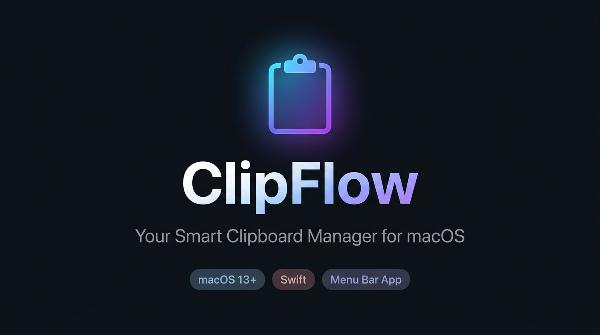

<p align="center">
  
</p>

<h1 align="center">ClipFlow</h1>

<p align="center">
  <strong>A lightweight, blazing-fast clipboard manager that lives in your macOS menu bar.</strong><br/>
  Track every text snippet, image, and file you copy — and instantly paste it back anywhere.
</p>

<p align="center">
  
  
  
  
  
</p>

---

## ✨ Features

| Feature | Description |
|---|---|
| 📋 **Clipboard History** | Automatically captures every text, image, and file you copy |
| 🔍 **Instant Search** | Real-time fuzzy search across your entire clipboard history |
| 📌 **Pin Items** | Pin frequently used snippets so they're always at the top |
| ⚡ **Auto-Paste** | Click an item and it instantly pastes into the focused app |
| 🖼️ **Image Support** | Saves PNG and TIFF images copied to the clipboard |
| 🗂️ **File Tracking** | Remembers files and folders copied in Finder |
| 🔗 **URL Detection** | Automatically detects and badges URLs in your history |
| 🔒 **Password Manager Safe** | Ignores entries from 1Password, Keychain, and other password tools |
| 🔈 **Sound Feedback** | Subtle audio click when items are copied (configurable) |
| 🚀 **Launch at Login** | Start automatically with macOS |
| ⌨️ **Keyboard-First** | Full keyboard navigation with global hotkey |
| 🌙 **Native Dark Mode** | Follows your system appearance automatically |

---

## 📋 Requirements

- **macOS 13.0 (Ventura)** or later
- **Apple Silicon (arm64)** Mac — M1, M2, M3, M4, etc.
- **Xcode Command Line Tools** (for building from source)

> **Intel Mac?** You can change the `-target` flag in `build.sh` from `arm64-apple-macosx13.0` to `x86_64-apple-macosx13.0` to build for Intel.

---

## 🚀 Quick Start

### 1. Clone the Repository

```bash
git clone https://github.com/shahnewaz5646455/Mac-ClipFlow.git
cd Mac-ClipFlow
```

### 2. Install Xcode Command Line Tools (if needed)

```bash
xcode-select --install
```

### 3. Build the App

```bash
chmod +x build.sh
./build.sh
```

This will:
- Compile `main.swift` into a native macOS binary
- Bundle it into `ClipFlow.app`
- Code-sign the app (ad-hoc if no certificate is available)

### 4. Launch ClipFlow

```bash
open ClipFlow.app
```

ClipFlow will appear as a **clipboard icon** (📋) in your menu bar. No Dock icon — it stays quietly in the background.

---

## 🔐 Permissions Setup

ClipFlow needs one macOS permission to work fully:

### Accessibility Access (Required for Auto-Paste)

Auto-paste (the ability to paste directly into another app after clicking) requires **Accessibility** permission.

1. Open **System Settings → Privacy & Security → Accessibility**
2. Click **+** and add **ClipFlow**
3. Toggle it **ON**

> If ClipFlow is not trusted, it will show an orange warning banner inside the panel with a quick **"Enable"** button that opens the correct settings page for you.

---

## 🎮 Keyboard Shortcuts

| Shortcut | Action |
|---|---|
| `⌥ V` (Option + V) | **Global Hotkey** — Show/Hide ClipFlow from anywhere |
| `↑` / `↓` | Navigate through clipboard items |
| `Enter` | Copy & auto-paste the selected item |
| `1` – `9` | Instantly copy & paste item by position (when search is empty) |
| `⌘1` – `⌘9` | Copy & paste item by position (works even while searching) |
| `Esc` | Close the ClipFlow panel |

---

## ⚙️ Settings

Click the **⚙️ gear icon** in the top-right corner of the panel to access Settings:

| Setting | Default | Description |
|---|---|---|
| **History Limit** | 100 items | Slide to set max history (10–250 items) |
| **Play Sound on Copy** | ON | Subtle audio click when copying |
| **Ignore Passwords** | ON | Skips entries from password managers |
| **Launch at Login** | OFF | Auto-start ClipFlow on login |

---

## 🗂️ Project Structure

```
Mac-ClipFlow/
├── main.swift          # Entire app in a single Swift file
├── build.sh            # Build & sign script
├── assets/             # Banner and screenshots
├── dummy_headers/      # Stub headers for compilation compatibility
├── ClipFlow.app/       # Built app bundle (generated by build.sh)
└── README.md
```

### Architecture Overview

```
main.swift
├── ClipboardItem       — Data model (text, image, file types)
├── ClipboardStore      — Observable state + NSPasteboard polling
├── HotKeyManager       — Global hotkey registration (Carbon)
├── UI Components
│   ├── SearchBar       — Live search input
│   ├── ClipboardRow    — Individual history item row
│   ├── EmptyStateView  — Shown when history is empty
│   └── SettingsView    — Settings panel
├── ContentView         — Root view with navigation
└── AppDelegate         — App lifecycle, status bar, popover
```

---

## 🛠️ Building with a Stable Code Signing Certificate (Optional)

By default, `build.sh` uses **ad-hoc signing** (`-`). To sign with a stable identity:

1. Open **Keychain Access**
2. Go to **Keychain Access → Certificate Assistant → Create a Certificate…**
3. Set the name to exactly: `ClipFlow Local Signer`
4. Set the type to: **Code Signing**
5. Click **Create**

Now run `./build.sh` — it will automatically detect and use your certificate.

---

## 🔄 Updating

To rebuild after pulling the latest changes:

```bash
git pull
./build.sh
open ClipFlow.app
```

> **Tip:** Close the old ClipFlow first (Settings → **Quit ClipFlow**) before relaunching.

---

## 🗑️ Uninstalling

1. Quit ClipFlow from its Settings panel
2. Delete `ClipFlow.app`
3. Remove stored data (optional):

```bash
rm -rf ~/Library/Application\ Support/ClipFlow
```

---

## 🐛 Troubleshooting

**ClipFlow doesn't appear in the menu bar after launching**
- Make sure you're opening `ClipFlow.app` (not the raw binary)
- Check if another instance is already running: `pgrep ClipFlow`

**Auto-paste doesn't work**
- Grant Accessibility permission in **System Settings → Privacy & Security → Accessibility**
- Restart ClipFlow after granting permission

**Build fails: "swiftc not found"**
- Run `xcode-select --install` to install Command Line Tools

**Build fails on Intel Mac**
- Edit line 40 in `build.sh`: change `arm64-apple-macosx13.0` → `x86_64-apple-macosx13.0`

**"ClipFlow is damaged and can't be opened"**
- Run: `xattr -cr ClipFlow.app` to clear quarantine attributes, then try again

---

## 🤝 Contributing

Contributions are welcome! Here's how to get started:

1. **Fork** this repository
2. **Create** a feature branch: `git checkout -b feature/my-feature`
3. **Commit** your changes: `git commit -m 'Add my feature'`
4. **Push** to the branch: `git push origin feature/my-feature`
5. **Open** a Pull Request

### Ideas for Contributions
- [ ] Intel (x86_64) support in build script
- [ ] Custom global hotkey configuration in Settings
- [ ] iCloud sync for clipboard history
- [ ] Markdown preview for text items
- [ ] Export history to JSON/CSV

---

## 📄 License

This project is licensed under the **MIT License** — see the [LICENSE](LICENSE) file for details.

---

## 🙏 Acknowledgements

- Built with **Swift** and **SwiftUI**
- Uses **Carbon** framework for global hotkey registration
- Uses **ServiceManagement** for Launch at Login
- Inspired by tools like Paste, Clipy, and Maccy

---

<p align="center">
  Made with ❤️ for macOS power users
</p>
